# Android-App des Forschungsprojektes
Ergänzend zu der vorgestellten [Installationsanleitung für das Knüppelzähler Forschungsprojekt](https://github.com/jobdk/openfaas-function/blob/master/readme.md)
dient diese Datei als Guide für die Android-App mit dem folgenden Inhalt:

# Inhalt
1. Screens/Dialoge und Funktionen
2. Schnittstellen
3. Plausibilitätsprüfungen
4. Installation der App

---
# Screens/Dialoge und Funktionen
1. Home-Screen
2. Add-Screen
3. More Options Dialog
4. Details Screen
5. Row-Mapping Dialog
6. CSV-Export Dialog

## Home-Screen
Auf dem Home-Screen der Android-App stehen die folgenden Funktionen zur Verfügung:
1. <b>Hinzufügen</b> neuer Einträge (Siehe <b>Add-Screen</b>)
2. <b>Interaktion (Öffnen, Löschen, CSV-Export)</b> mit vorhandenen Einträgen (Siehe <b>More Options Dialog</b>)
3. <b>Suche</b> von Einträgen mit einer einfachen Textsuche

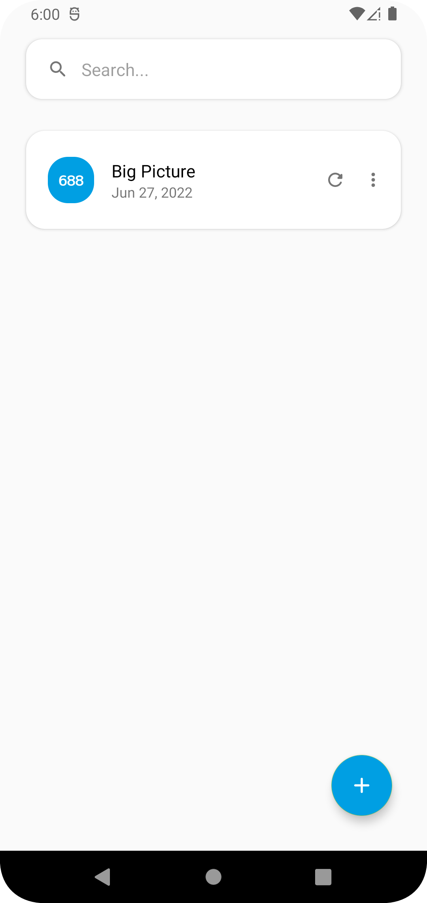

## Add-Screen
Der Add-Screen bietet dem Nutzer die Möglichkeit, neue Aufnahmen von Knüppelbildern an die OpenFaaS-Funktionen zu versenden. <br>
Dafür sind die folgenden Informationen erforderlich:
1. Titel des neu zu erstellenden Eintrags (Über ein einfaches Textfeld zur Identifikation)
2. Ein Bild des Knüppelhaufens

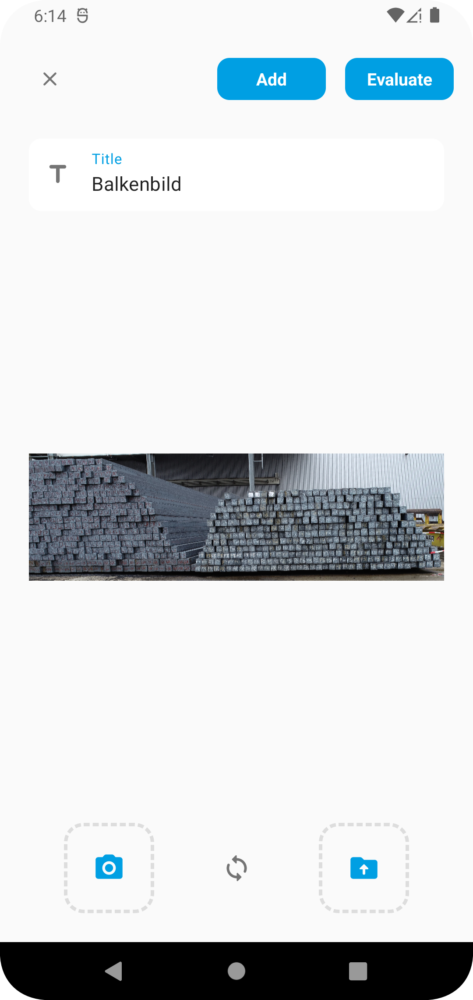

Für die <b>Bildauswahl</b> stehen zwei Optionen zur Auswahl:
1. Ein neues Bild mit der <b>Kamera</b> des mobilen Endgerätes aufnehmen
2. Ein Bild aus dem <b>Dateisystem</b> des mobilen Endgerätes hereinladen

Nach der Auswahl eines Bildes erscheint dieses in der Mitte des Bildschirms. Dem Nutzer stehen nun die folgenden Optionen zur Verfügung:
1. Mit dem <b>Add</b>-Button wird das Bild lediglich <b>lokal</b> gespeichert (Eine spätere Evaluation ist möglich).
2. Mit dem <b>Evaluate</b>-Button wird das Bild an eine OpenFaaS-Funktion zur Auswertung versendet. Zusätzlich wird es lokal gespeichert.


#### ! Wichtig !
Damit die Algorithmen der App reibungslos funktionieren, ist es sinnvoll, dass die Knüppel-Bilder möglichst parallel zum Boden aufgenommen werden.<br>
Andernfalls kann es passieren, dass die Knüppel einer falschen <b>Zeile</b> zugeordnet werden und somit unerwartete Ergebnisse auftreten.


## More Options Dialog
Dieser Dialog stellt einige Interaktionsmöglichkeiten für bereits erstellte Einträge dar.


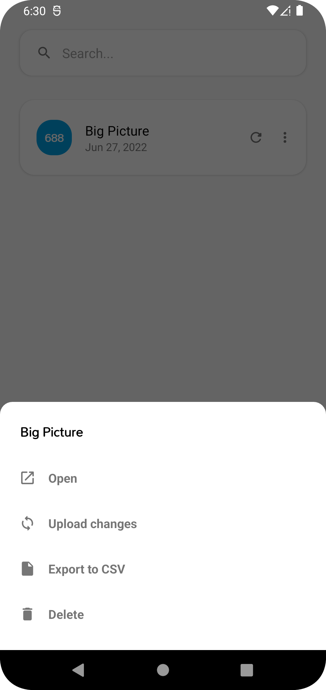


1. <b>Öffnen</b> - Navigiert den Nutzer zum <b>Details-Screen</b> des Eintrags
2. <b>Änderungen hochladen</b> - Die lokal vorgenommenen Änderungen an den <b>Persister</b> senden
3. <b>CSV-Export</b> - Die Knüppel-Positionen und Beschriftungen als CSV exportieren (Siehe <b>CSV-Export Dialog</b>)
4. <b>Löschen</b> - Löscht den Eintrag aus der lokalen Datenbank


## Details-Screen
In diesem Screen kann der Nutzer manuelle Anpassungen der Knüppel-Positionen und Beschriftungen vornehmen.<br>

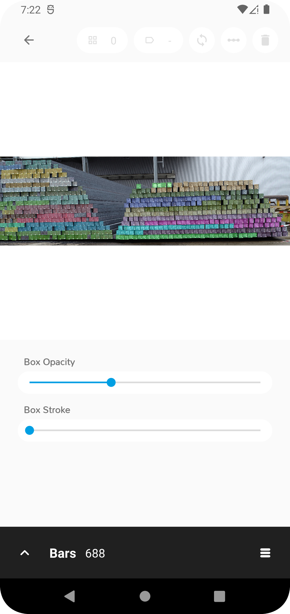

In dem unteren Bereich des Screens stehen Optionen für die visuelle Hervorhebung der Knüppel zur Verfügung. <br>
Dabei kann der Nutzer die <b>Farbstärke (Opacity)</b> und <b>Breite</b> des Randes der erkannten Knüppel anpassen, wodurch Lücken im Knüppel-Haufen leicht auszumachen sind <br>

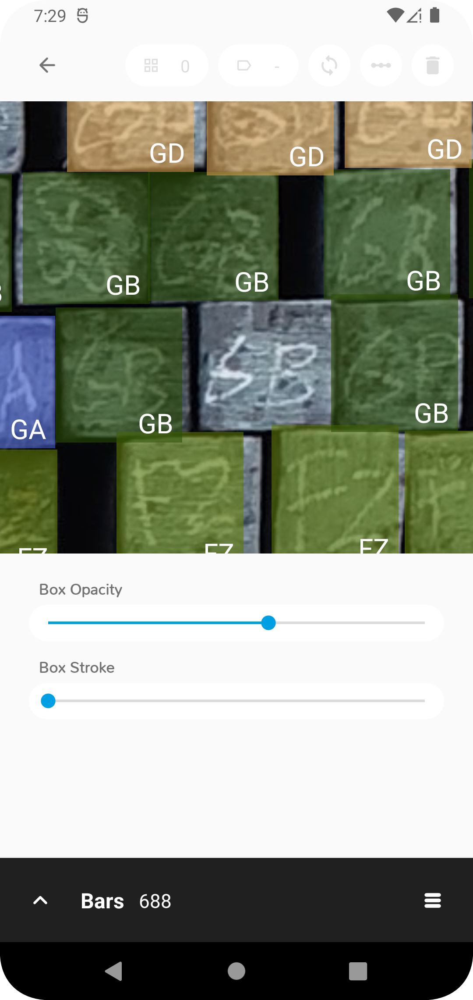

Für die Interaktion mit dem Bild stehen dem Nutzer einige Möglichkeiten zur Verfügung:
* <b>Klick</b> auf einen Knüppel - Selektiert den Knüppel und hebt diesen Farblich hervor.<br>
  Selektierte Knüppel können gelöscht oder dessen Beschriftung angepasst werden.
* <b>Lange halten</b> auf einem Knüppel - Startet ein Drag and Drop mit dem Knüppel.<br>
  Dieser kann in einen beliebigen Bereich des Bildes verschoben werden.
* <b>Lange halten</b> auf einer freie Stelle - Erstellt einen neuen Knüppel-Eintrag mit leerer Beschriftung auf der interagierten Fläche.

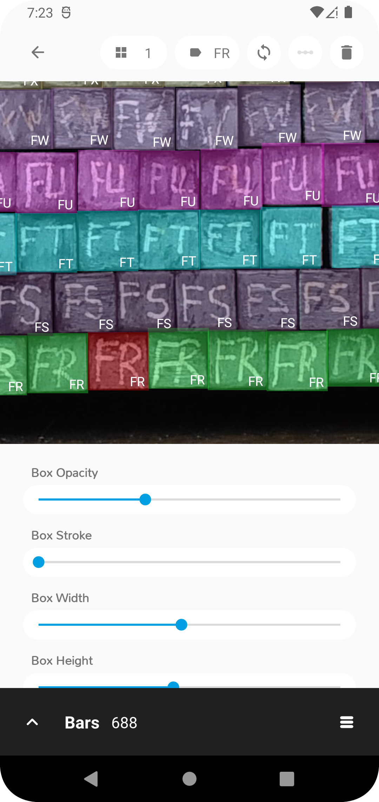

Mit dem Klick auf das Burgermenu unten rechts in der Ecke, kann der Nutzer zum <b>Row-Mapping Dialog</b> navigieren.


## Row-Mapping Dialog
Mit diesem Dialog ist es möglich, die Knüppel-Positionen und Beschriftungen in Zusammenfassung darzustellen.<br>
Dabei werden die Knüppel in der von NDW spezifizierten Form formatiert und angezeigt.<br>
Die folgende Abbildung stellt diesen Sachverhalt dar:

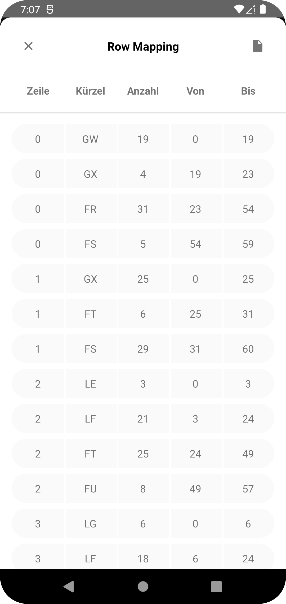

## CSV-Export Dialog
Mit dem CSV-Export Dialog ist es möglich, die Knüppel in der vom Row-Mapping Dialog angezeigten Form als CSV zu exportieren. <br>
Für den Export dieser Informationen werden dabei lediglich die folgenden Informationen benötigt:
1. Der <b>Name</b> der Datei (Standardwert ist der Name des Eintrags)
2. Checkbox (True/False), ob ein <b>Header</b> mit Spaltenbeschriftungen der Datei hinzugefügt werden soll.

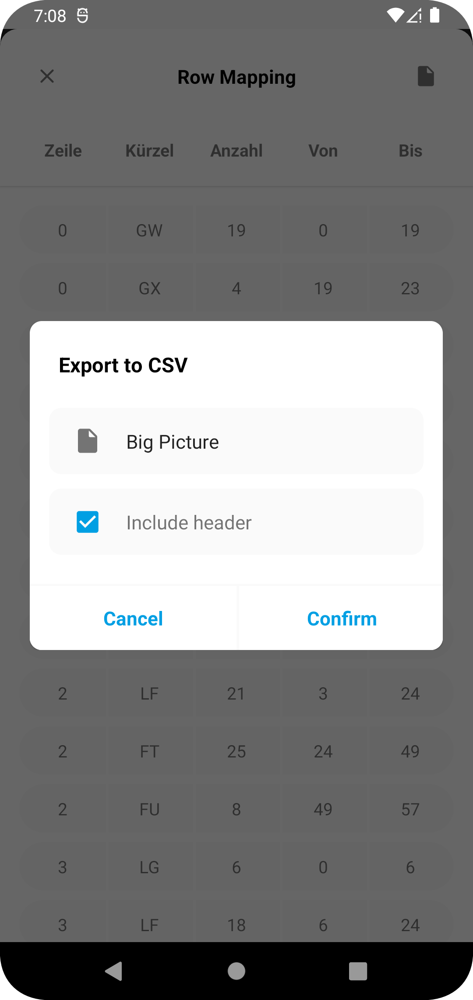

---
# Schnittstellen
Die OpenFaaS-Funktionen werden auf einer VM der Hoschule Furtwangen gehostet und sind zum Stand des Forschungsprojektes ausschließlich über das hochschulinterne <b>VPN</b> erreichbar. 
Somit muss bspw. ein VPN Client auf dem mobilen Endgerät installiert und gestartet werden, um eine Kommunikation zu ermöglichen.

## barextractorfunction
**Adresse**: http://141.28.73.147:8080/function/barextractorfunction

**Request-Body:**<br>
Sendet ein Bild an die <b>OpenFaaS-barextractorfunction</b> in dem folgenden Format:

```json
{
  "name": "Knüppelhaufen",
  "time": 1220227200,
  "extension": "png",
  "image": "<Base64 codiertes Bild>",
  "result": null
}
```
**Response-Body:**<br>
Gibt den Text und die Koordinaten der erkannten Knüppel zurück:

```json
[
  {
    "caption": "GM",
    "left": 129.60374069213867,
    "top": 68.19547271728516,
    "right": 198.8857421875,
    "bottom": 139.75296020507812
  },
  {
    "caption": "GM",
    "left": 69.86802673339844,
    "top": 0.5825424194335938,
    "right": 139.07223510742188,
    "bottom": 70.78595733642578
  }
]
```

## persistresultfunction
**Adresse**: http://141.28.73.147:8080/function/persistresultfunction

**Request-Body**:<br>
Sendet ein angepasstes Ergebnis an die <b>OpenFaaS-persistresultfunction</b> in dem folgenden Format:
```json
{
  "name": "Knüppelhaufen",
  "time": 1220227200,
  "extension": null,
  "image": null,
  "result": [
    {
      "caption": "GM",
      "left": 129.60374069213867,
      "top": 68.19547271728516,
      "right": 198.8857421875,
      "bottom": 139.75296020507812
    },
    {
      "caption": "GM",
      "left": 69.86802673339844,
      "top": 0.5825424194335938,
      "right": 139.07223510742188,
      "bottom": 70.78595733642578
    }
  ]
}
```
**Response:**<br>
Gibt über einen <b>HTTP-Statuscode</b> Information darüber, ob der Upload erfolgreich war.

---
# Plausibilitätsprüfungen
Es wurden einige Plausibilitätsprüfungen implementiert, um die vom ML-Algorithmus zurückgelieferten Ergebnisse automatisiert zu korrigieren.
Zu diesem Zweck wurden die folgenden Funktionen entwickelt, welche in beliebiger Reihenfolge und beliebig oft angewendet werden können.

#### filterOverlappingBars(percentage: Float)
Diese Funktion entfernt erkannte Knüppel, welche Überschneidungen mit anderen Knüppeln besitzen. <br>
Der Prozentsatz kann dabei als Parameter übergeben werden.

**Beispiel:**<br>
*filterOverlappingBars(0.8f)*

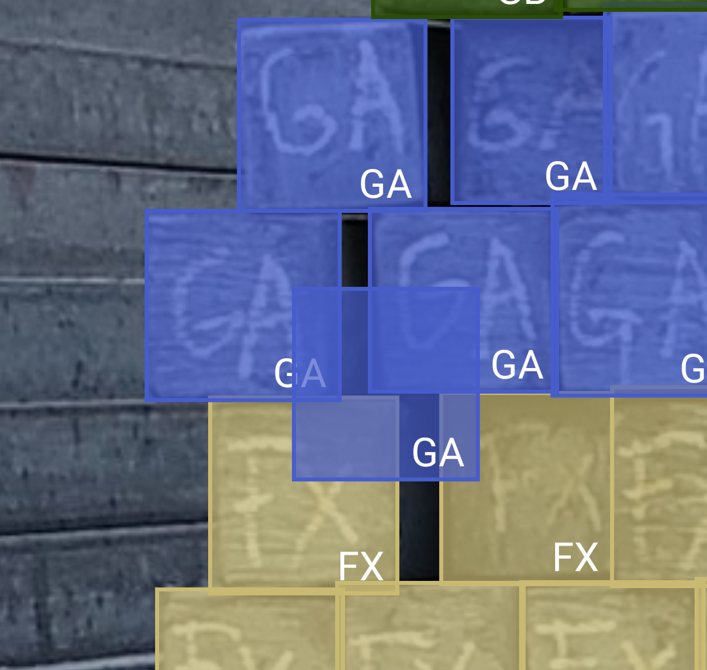

#### fixBarDimensions(averageBarDimensions: BoxDimensions, averageDimensionMultiplier: Float)
Diese Funktion passt automatisch die Dimensionen (Breite und Höhe) von erkannten Knüppeln an, wenn diese größer als ein bestimmter Threshold sind. <br>
Als Threshold wird dabei die durchschnittliche Dimension eines Knüppels (BoxDimensions) verwendet und mit einem averageDimensionMultiplier multipliziert.
Die durchschnittliche BoxDimensions werden dabei von dem jeweiligen Knüppelhaufen berechnet.

**Beispiel:**<br>
*fixBarDimensions(BoxDimensions(width = 72f, height = 70f), 1.15f)*<br>
Jegliche Knüppel, die breiter als 72 * 1.15 oder höher als 70 * 1.15 sind werden in die entsprechende Richtung verkleinert.

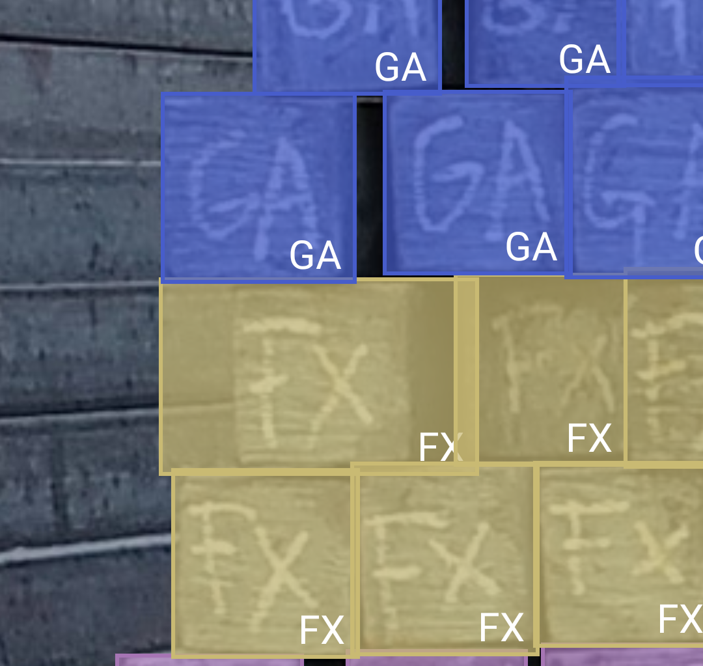


#### filterIsolatedBars(averageBarDimensions: BoxDimensions, averageDimensionMultiplier: Float)
Diese Funktion entfernt Knüppel, welche keine Knüppel in einer bestimmten Distanz um sich herum besitzen.
Als Distanz wird dabei die durschnittliche Breite und Höhe (BoxDimensions) der Knüppel verwendet, welche mit einem averageDimensionMultiplier multipliziert werden.<br>

**Beispiel:**<br>
*filterIsolatedBars(BoxDimensions(width = 72f, height = 70f), 1.15f)*<br>

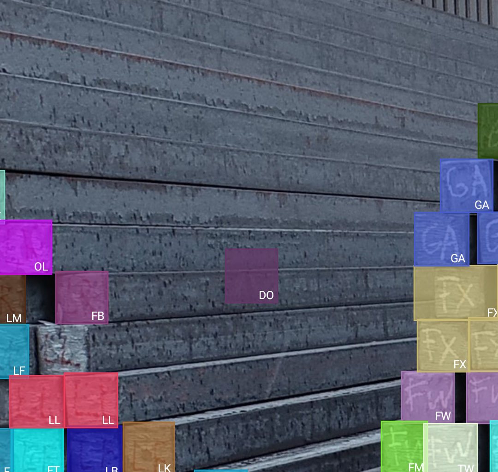

#### adjustBatchIdsIfPossible(lookAheadOnEachSide: Int, acceptanceThreshold: Float)
Diese Funktion passt autoamtisiert die Labels eines Knüppels an, wenn sich um diesen herum (rechts und links) Knüppel mit dem gleichen Label befinden
und der angegebene acceptanceThreshold überschritten wird.

**Beispiel:**<br>
*adjustBatchIdsIfPossible(2, 1f)*<br>

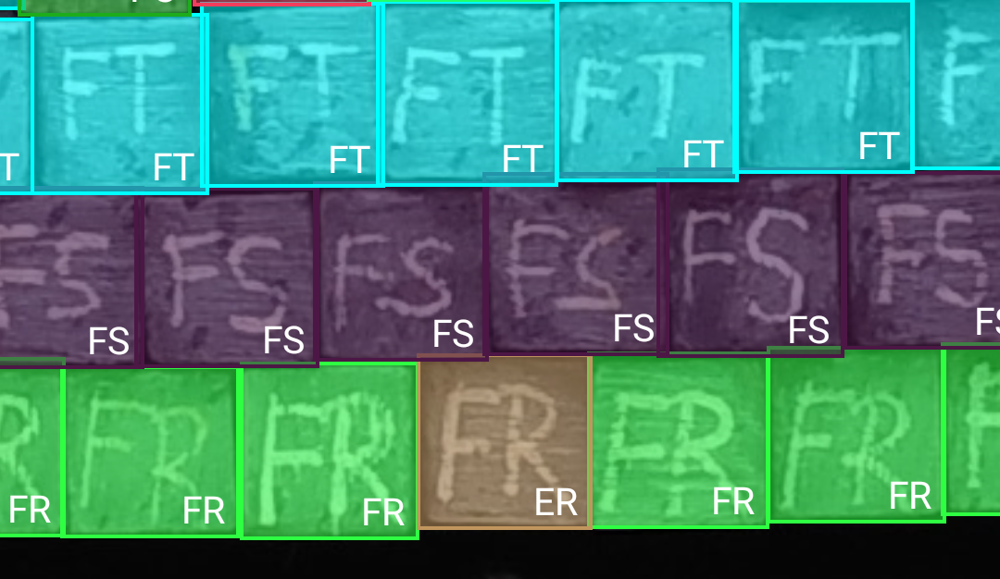

Ein Knüppel in der untersten Zeile wurde hier als <b>ER</b> erkannt, obwohl es sich um einen <b>FR</b> Knüppel handelt. Da die Funktion mit einem
<b>lookAheadOnEachSide</b> von 2 und einem <b>acceptanceThreshold</b> von 1 aufgerufen wird, müssen sich 2 links und 2 rechts neben dem Knüppel (ER)
ausschließlich Knüppel desselben Labels befinden, damit dieser automatisch angepasst wird (In diesem Beispiel <b>FR</b>). <br>

--> Da sich in diesem Beispiel 2 links und 2 rechts neben dem <b>ER</b> Knüppel nur <b>FR</b> Knüppel befinden, wird <b>ER</b> zu <b>FR</b> angepasst


*adjustBatchIdsIfPossible(2, 0.5f)*<br>

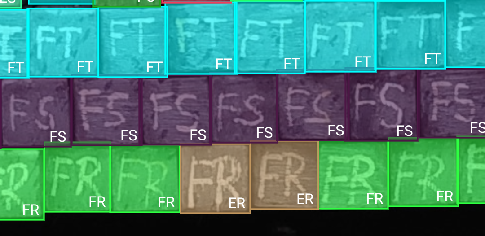

Zwei Knüppel in der untersten Zeile wurden hier als <b>ER</b> erkannt, obwohl es sich um einen <b>FR</b> Knüppel handelt. Da die Funktion mit einem
<b>lookAheadOnEachSide</b> von 2 und einem <b>acceptanceThreshold</b> von 0.5 aufgerufen wird, müssen sich 2 links und 2 rechts neben einem ER Knüppel
mehr als (2 + 2) * 0.5 = <b>2</b> Knüppel mit demselben Label befinden.

--> In diesem Beispiel sind neben dem <b>ER</b> Knüppel 3 <b>FR</b> und 1 <b>ER</b> Knüppel und somit mehr als 2 Knüppel eines Labels vorhanden.


#### adjustSpacesBetweenBatchGroups(minBatchAppearanceOnEachSide: Int)
Diese Funktion passt alle Knüppel an, welche von mindestens <b>minBatchAppearanceOnEachSide</b> Knüppeln eingeschlossen werden.

**Beispiel:**<br>
*adjustSpacesBetweenBatchGroups(5)*

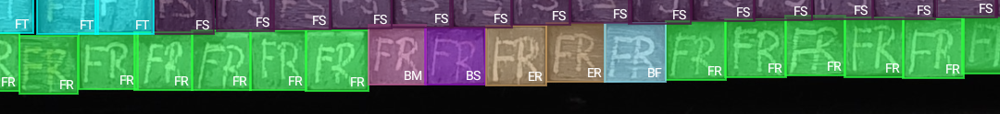

In diesem Beispiel befinden sich zwischen 2 FR Knüppelvorkommen noch widersprüchliche Knüppelwerte. Da sowohl rechts als auch links von den widersprüchlichen
Werten 5 <b>FR</b> Knüppel sind, werden die Label aller Knüppel zwischendrin zu <b>FR</b> angepasst.


#### adjustLonelyBarsBetween(lookAheadOnEachSide: Int, minMostCommonBarThreshold: Float , batchMap: Map<String, Batch>)
Diese Funktion passt das Label eines Knüppel an, welche sich neben diesem Knüppel mit einem anderen Label befinden.

**Beispiel:**<br>
*adjustLonelyBarsBetween(3, 1f, batchMap)*

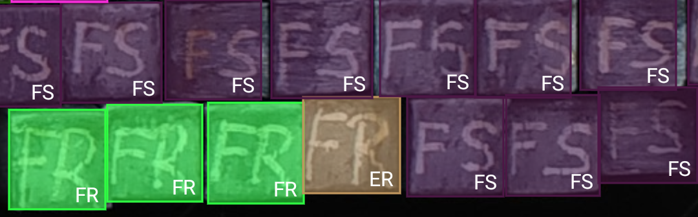

--> In diesem Beispiel befindet sich ein als <b>ER</b> erkannter Knüppel zwischen <b>FS</b> und <b>FR</b> Knüppeln. Da das <b>ER</b> mehr
Überschneidung mit <b>FR</b> als mit <b>FS</b> hat, wird <b>ER</b> zu <b>FR</b> angepasst.

---
# Installation der App

## Debug-Modus
Die Installation der Android App auf einem mobilen Endgerät erfolgt zum Stand des Forschungsprojektes ausschließlich über die IDE Android Studio im Debug-Modus.<br>
Hierfür müssen die Entwickleroptionen des Android Gerätes aktiviert werden. Die Applikation kann nun mit <b>USB-Debugging</b> oder über <b>WLAN</b> installiert werden. <br>
Ein Artikel für die Installation einer App auf einem physischen Endgerät im <b>Debug-Modus</b> kann [hier](https://developer.android.com/studio/run/device) gefunden werden.

## Produktiv-Modus
Um eine Android-App im Produktiv-Modus nutzen zu können, muss eine <b>APK</b> aus dieser erstellt werden. Dadurch ist es sehr einfach möglich, die App auf mehrere Endgeräte zu verteilen.
Da für die Erstellung einer <b>APK</b> einige sensible Daten festgelegt werden müssen, wurde diese im Rahmen des Forschungsprojektes nicht erstellt. <br>
Einen Leitfaden für die Erstellung einer solchen <b>APK</b> kann [hier](https://developer.android.com/studio/publish) gefunden werden. 
  
